PENJELASAAN AL GORITMA DENGAN CONTOH LATIHAN1.PY,LATIHAN2.PY,PROGRAM1
- Pertama Kita Bahas Alur Algoritma Program "Latihan1.py"

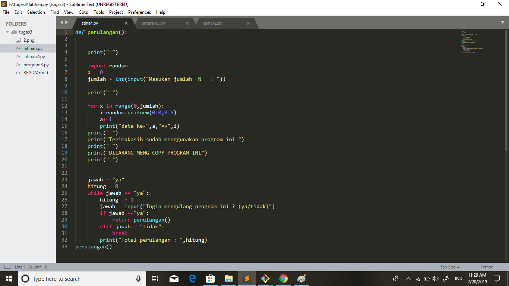

PERULANGAN Perulangan dalam dalam bahasa pemrograman merupakan suatu pernyataan untuk menginstruksi komputer agar melakukan sesuatu secara berulang. Terdapat dua jenis perulangan dalam bahasa pemrograman python, yaitu perulangan dengan for dan while.

1.Perulangan for
Perulangan for disebut juga sebagai counted loop (perulangan yang terhitung), yaitu perintah yang dieksekusi secara berulang berdasarkan jumlah perulangan tertentu. Contoh :

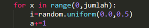

2.Perulangan while
Perulangan while disebut uncounted loop (perulangan yang tak terhitung), yaitu perulangan yang dilakukan berdasarkan kondisi tertentu selama nilai kondisi bernilai TRUE. Contoh :

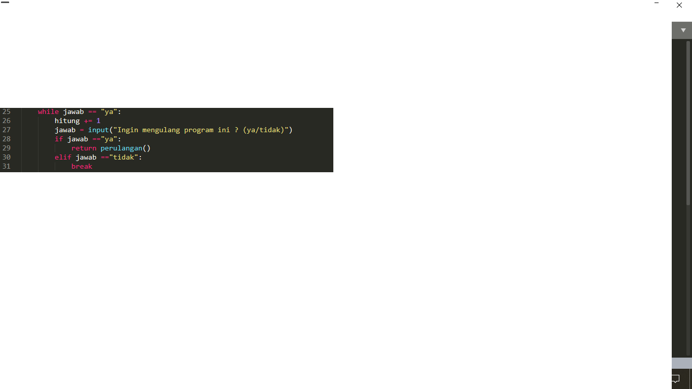

Pernyataan break dan continue Pernyataan break digunakan untuk menghentikan proses perulangan pada kondisi tertentu, sedangkan pernyataan continue digunakan untuk melanjutkan pada iterasi selanjutnya pada kondisi tertentu. Contoh :

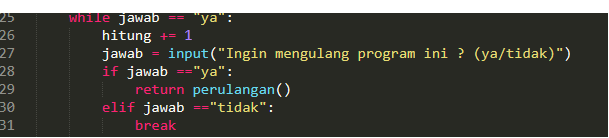

random() Pengacakan, pembangkit bilangan acak, atau random dapat digunakan untuk berbagai macam hal. Nilai random kadang dibutuhkan juga untuk menentukan suatu pilihan. Contoh :

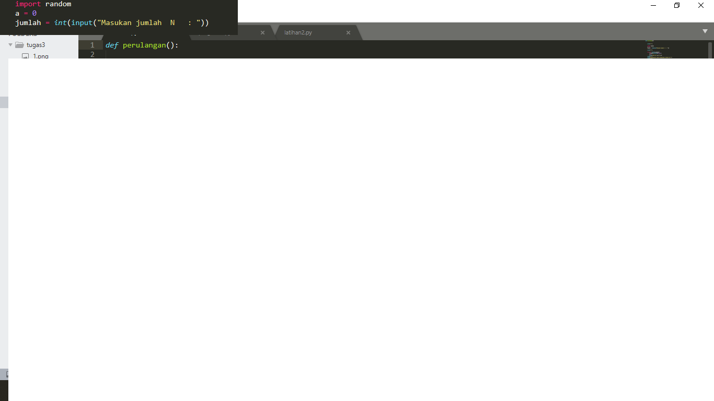

Hasil Output nya >>>>>>>>>

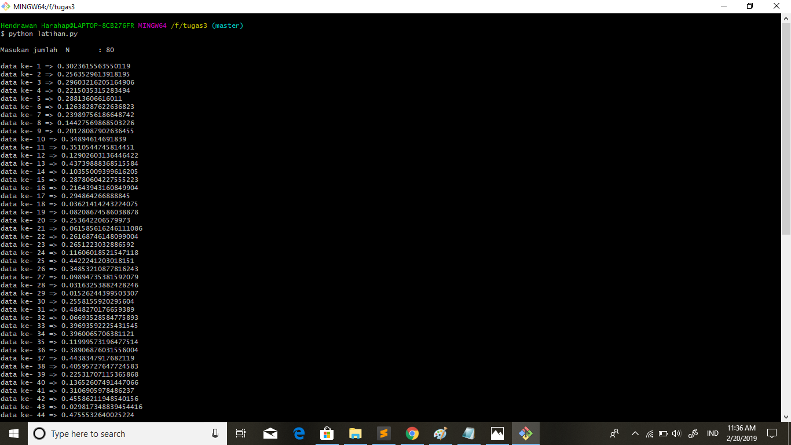

Kedua Kita Bahas Alur Algoritma Program "Latihan2.py"
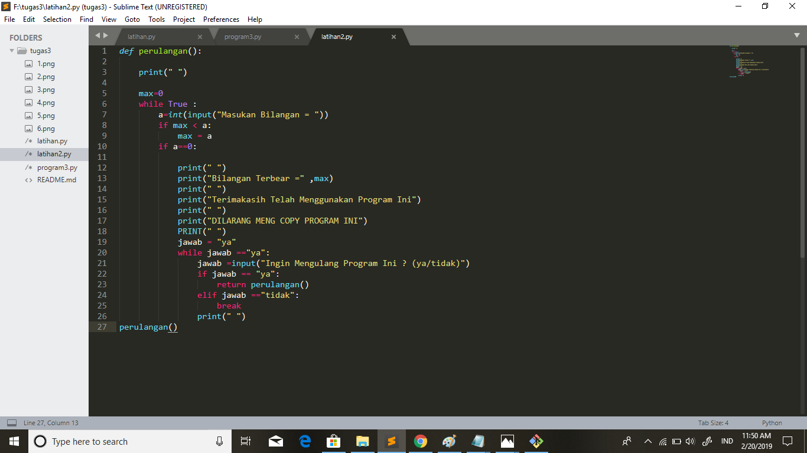

Fungsi max() di pemrograman python Fungsi max() adalah fungsi bulid-in untuk mencari nilai tertinggi. Fungsi ini dapat diberikan sebuah parameter berupa angka. Contoh :

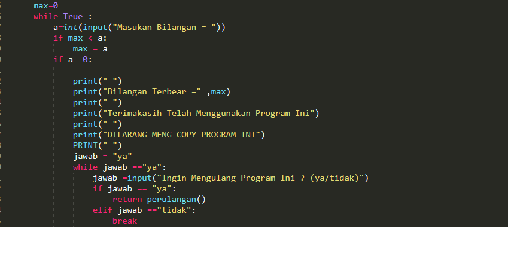

1.Perulangan while
Perulangan while disebut uncounted loop (perulangan yang tak terhitung), yaitu perulangan yang dilakukan berdasarkan kondisi tertentu selama nilai kondisi bernilai TRUE. Contoh :

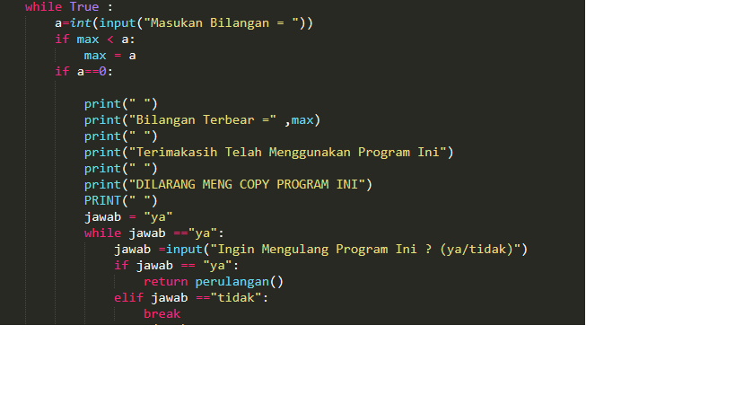

Pernyataan break dan continue Pernyataan break digunakan untuk menghentikan proses perulangan pada kondisi tertentu, sedangkan pernyataan continue digunakan untuk melanjutkan pada iterasi selanjutnya pada kondisi tertentu. Contoh :

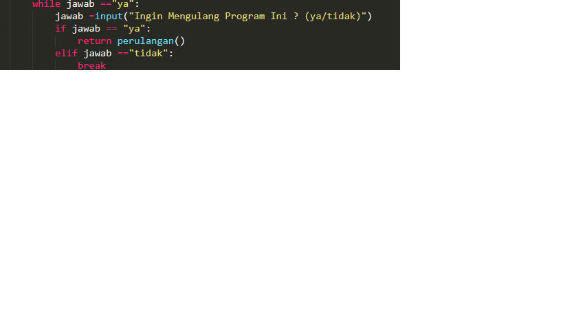

Hasil Output nya >>>>>>>>>

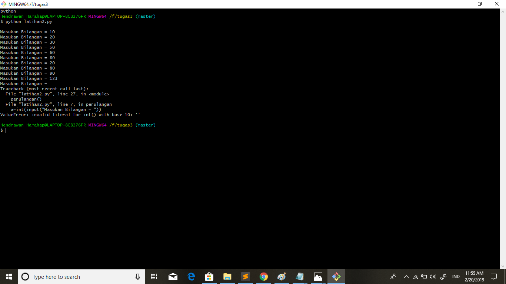

Ketiga Kita Bahas Alur Algoritma Program "Program1.py"

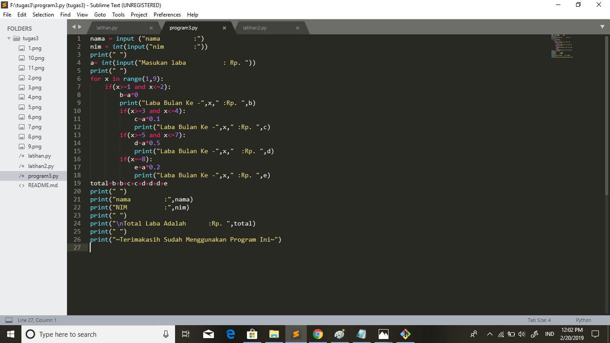

1.Perulangan for
Perulangan for disebut juga sebagai counted loop (perulangan yang terhitung), yaitu perintah yang dieksekusi secara berulang berdasarkan jumlah perulangan tertentu. Contoh :

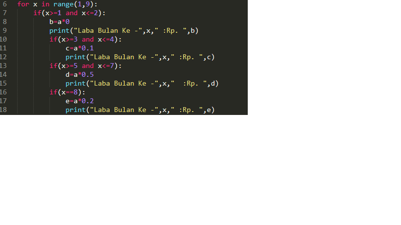

2.Menggunakan kondisional if
Seperti halnya bahasa pemrograman yang lain, bahasa python juga mempunyai percabangan berupa if yaitu bila suatu kondisi tertentu tercapa maka apa yang harus dilakukan. Dengan fungsi ini kita bisa menjalankan suatu perintah dalam kondisi tertentu. Contoh :

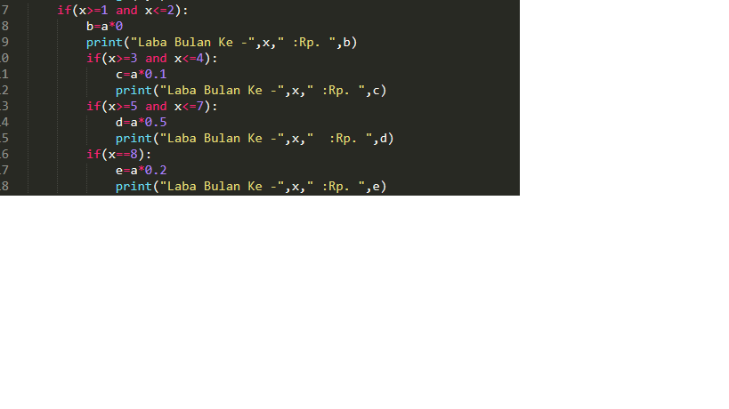

Hasil Output nya >>>>>>>>>

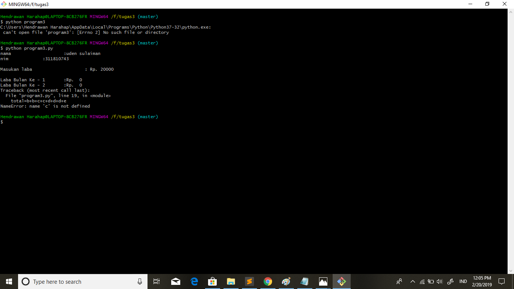

